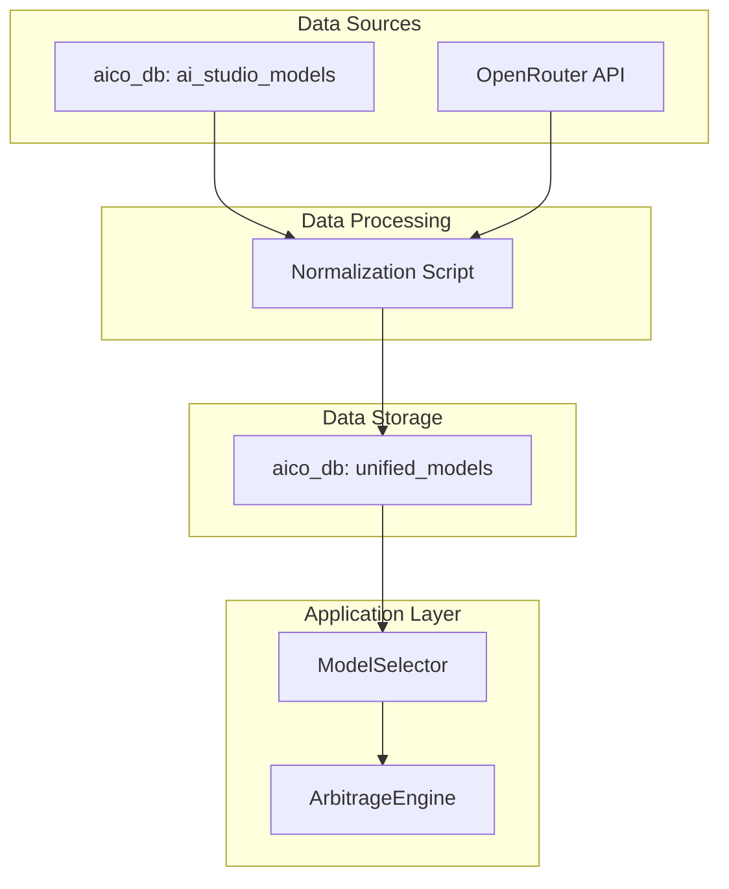

# Unified Model Management Plan

This document outlines the plan to create a unified view of language models from both Gemini and OpenRouter, allowing for dynamic selection based on a range of parameters rather than specific model names.

## Plan

1.  **Data Ingestion and Normalization:** Create a script to fetch data from both the `ai_studio_models` table and the OpenRouter API, and normalize it to fit the schema of the `models` table.
2.  **Create a Unified Model Table:** Write a SQL query to create a new table, `unified_models`, that combines the normalized data from both sources.
3.  **Implement Model Selection Logic:** Develop a `ModelSelector` class that can query the `unified_models` table based on a range of parameters (e.g., min/max context, tool calling, vision).
4.  **Integrate Model Selector:** Update the `ArbitrageEngine` to use the new `ModelSelector` for dynamic model selection.
5.  **Documentation:** Add the plan and a Mermaid diagram to a new document, `docs/unified-model-management.md`, to outline the new architecture.

## Architecture Diagram

